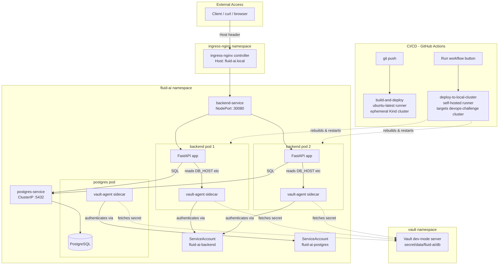

# DevOps Challenge — Kubernetes + CI/CD + Vault

A FastAPI backend + PostgreSQL stack, deployed to Kubernetes (Kind), with secrets
managed entirely through HashiCorp Vault (no Kubernetes Secret objects, no
hardcoded credentials anywhere), an Ingress layer, and two independent GitHub
Actions CI/CD paths.

## Architecture



**Reading this diagram**: a request arrives with `Host: fluid-ai.local`,
gets routed by the Ingress controller to `backend-service`, load-balanced
across two backend pods. Each pod has a `vault-agent` sidecar that
authenticated to Vault using the pod's ServiceAccount identity and wrote
the DB credentials to a file the app reads at startup - never a
Kubernetes Secret. The backend talks to Postgres the same way, through its
own service and its own Vault-authenticated sidecar. Separately, two
independent CI/CD paths exist: pushes trigger a fully disposable cloud
build/deploy cycle that proves the pipeline works from scratch, while a
manual "Run workflow" click drives a self-hosted runner that updates the
actual local cluster shown in the rest of this diagram.

## Backend

- **Framework**: FastAPI, structured as `main.py` (app assembly) + `db.py`
  (connection layer, fail-fast on missing config) + `routers/health.py` +
  `routers/items.py`.
- **Endpoints**: `GET /health` (liveness — no DB dependency, intentionally),
  `GET /ready` (readiness — checks DB connectivity), `GET /items`,
  `POST /items`.
- **Why liveness doesn't check the DB**: if it did, a Postgres outage would
  cause Kubernetes to kill and restart otherwise-healthy backend pods,
  turning one outage into a restart storm. Readiness (which does check the
  DB) is what controls traffic routing instead.

## Secret Management — HashiCorp Vault (the chosen reliability improvement)

**Why this over a plain Kubernetes Secret**: a Secret object's values are
only base64-encoded, not encrypted, and are visible to anyone with `get
secret` RBAC access or a `kubectl get secret -o yaml`. Vault centralizes
storage, encrypts at rest, and lets each app authenticate with its own
scoped, revocable identity instead of a shared static credential baked into
a manifest.

**How it works**: the Vault Agent Injector (a mutating admission webhook)
reads annotations on each Deployment and automatically adds an init
container + sidecar to the pod. That sidecar authenticates to Vault using
the pod's Kubernetes ServiceAccount identity, fetches the secret from
`secret/data/fluid-ai/db`, and renders it to a file at
`/vault/secrets/db-env` inside the pod — nowhere else. `entrypoint.sh`
sources that file into real environment variables before starting the app.

**Verified, repeatedly, throughout this project**:
```bash
kubectl get secrets -n fluid-ai
# No resources found in fluid-ai namespace.

grep -n "apppassword\|postgres-service\|appuser\|appdb" app/db.py app/main.py
# (empty - zero hardcoded credentials)

kubectl exec -it <backend-pod> -n fluid-ai -c backend -- cat //vault/secrets/db-env
# export DB_HOST="postgres-service"
# ...(only visible inside the live pod, gone the moment it restarts)
```

**Tradeoff**: Vault dev mode (used here) runs unsealed, in-memory, with a
single root token - explicitly not production-safe. A real deployment would
use HA Vault or HCP Vault with auto-unseal via a cloud KMS.

## How environment variables flow through Vault (end to end)

Six distinct steps, from where a credential is born to where Python
actually reads it - no step is skipped or shortcut anywhere in this chain:

**1. Vault stores the source of truth.** One secret, one path, five
key-value pairs:
```bash
vault kv put secret/fluid-ai/db \
  host="postgres-service" port="5432" name="appdb" user="appuser" password="apppassword"
```
Encrypted inside Vault's own storage. Not a file on disk, not in
Kubernetes at all.

**2. Kubernetes manifests annotate which pods should receive it.** In
`backend-deployment.yaml`, the pod template carries:
```yaml
annotations:
  vault.hashicorp.com/agent-inject: "true"
  vault.hashicorp.com/role: "fluid-ai-backend"
  vault.hashicorp.com/agent-inject-secret-db-env: "secret/data/fluid-ai/db"
  vault.hashicorp.com/agent-inject-template-db-env: |
    {{- with secret "secret/data/fluid-ai/db" -}}
    export DB_HOST="{{ .Data.data.host }}"
    export DB_PORT="{{ .Data.data.port }}"
    export DB_NAME="{{ .Data.data.name }}"
    export DB_USER="{{ .Data.data.user }}"
    export DB_PASSWORD="{{ .Data.data.password }}"
    {{- end -}}
```
These aren't native Kubernetes fields - they're read by the **Vault Agent
Injector** (a mutating admission webhook installed via Helm), which rewrites
the pod spec at creation time to add an init container and sidecar that
were never written by hand.

**3. At pod startup, the sidecar authenticates.** The pod runs under
`serviceAccountName: fluid-ai-backend`. The injected sidecar uses that
ServiceAccount's auto-mounted Kubernetes token to authenticate to Vault,
which verifies the token against the API server and, matching the
`fluid-ai-backend` role bound earlier to a read-only policy, returns a
scoped Vault token.

**4. The sidecar renders the template to a file.** Using that token, it
fetches the secret and writes the rendered result to `/vault/secrets/db-env`
- an `emptyDir` volume, RAM-backed, existing only for that pod's lifetime.

**5. `entrypoint.sh` turns the file into real environment variables:**
```bash
#!/bin/sh
if [ ! -f /vault/secrets/db-env ]; then
  echo "FATAL: /vault/secrets/db-env not found." >&2
  exit 1
fi
. /vault/secrets/db-env
exec uvicorn main:app --host 0.0.0.0 --port 8000
```
`. /vault/secrets/db-env` sources the file, loading each `export DB_HOST=...`
line into the shell's environment. `exec` then replaces the shell process
with `uvicorn`, which inherits that environment rather than losing it to a
child-process boundary.

**6. `db.py` reads them as plain environment variables - no Vault
awareness at all:**
```python
REQUIRED_DB_VARS = ["DB_HOST", "DB_PORT", "DB_NAME", "DB_USER", "DB_PASSWORD"]

def _load_db_config() -> dict:
    missing = [v for v in REQUIRED_DB_VARS if not os.environ.get(v)]
    if missing:
        raise RuntimeError(f"Missing required DB env vars: {missing}. ...")
    return {"host": os.environ["DB_HOST"], "port": os.environ["DB_PORT"], ...}
```
No `hvac` library, no token handling, no Vault API calls in application
code - just `os.environ[...]`, exactly like any standard 12-factor app.
Missing vars raise immediately at import time, so the app refuses to start
rather than silently running with wrong or empty credentials.

**Summary of the chain**: Vault (encrypted storage) to Kubernetes Agent
Injector (reads annotations, adds sidecar) to sidecar (authenticates via
ServiceAccount token, fetches and renders secret to a pod-local file) to
`entrypoint.sh` (sources file into shell env vars) to `exec` (hands vars to
uvicorn/Python) to `db.py` (reads via plain `os.environ`). No step touches
a Kubernetes Secret object, a `.env` file, git, or the Docker image -
verified directly via `kubectl get secrets`, a `grep` across the codebase,
and `cat //vault/secrets/db-env` inside a live pod.

## Ingress

`ingress-nginx` routes `Host: fluid-ai.local` to `backend-service`. Not the
chosen reliability improvement (that's Vault), but implemented and working
as a bonus. Since `fluid-ai.local` isn't a real DNS record, it's tested with
an explicit `Host` header rather than relying on browser DNS resolution.

## CI/CD — two independent, complementary paths

### 1. build-and-deploy (cloud runner, every push + manual)
Runs on GitHub-hosted `ubuntu-latest`. Builds the Docker image, spins up its
own disposable Kind cluster inside the runner, installs Vault via Helm,
configures Kubernetes auth/policies/roles, applies all manifests, waits for
both rollouts, and smoke-tests `/health`. This proves the entire pipeline is
reproducible from a clean slate - the cluster is destroyed when the job
ends, so this validates the process, not a persistent deployment.

### 2. deploy-to-local-cluster (self-hosted runner, manual trigger only)
Runs on a self-hosted runner registered on the same machine as the actual
demo cluster (devops-challenge). Rebuilds the image, loads it via
`kind load docker-image`, and restarts the backend Deployment - the
automated equivalent of the manual rebuild cycle used throughout local
development. Deliberately gated to `workflow_dispatch` only (never on
`push`) so an ordinary commit can't unexpectedly restart the live demo
cluster mid-recording.

## Real debugging encountered while building this

These weren't staged - they're genuine issues hit and resolved during
development, kept here because the debugging methodology is arguably more
useful evidence than a synthetic failure:

1. **`AttributeError: module 'db' has no attribute 'init_schema'`** - a fix
   was written to the wrong directory (project root instead of `app/`),
   so the Docker image kept building the old `db.py`. Diagnosed by
   extracting the file directly from the built image
   (`docker run --rm --entrypoint cat <image> //app/db.py`) rather than
   trusting the source tree, which revealed the stale version immediately.
2. **`exec ./entrypoint.sh: no such file or directory` (self-hosted
   runner, attempt 1)** - `kind.exe` wasn't on the Windows system PATH for
   the runner's PowerShell session (it was only reachable via a Git
   Bash-specific PATH entry). Fixed by permanently adding the binary's
   folder to the user PATH.
3. **Same error, attempt 2 - CRLF line-ending corruption** - a fresh
   checkout on the Windows runner converted `entrypoint.sh` from Unix LF
   to Windows CRLF, breaking the shebang line
   (`#!/bin/sh` became `#!/bin/sh\r`) so the container couldn't exec its
   own entrypoint. A `.gitattributes` rule didn't reliably prevent this on
   the runner's checkout, so the fix was moved into the Dockerfile itself -
   `RUN sed -i 's/\r$//' entrypoint.sh` strips any stray `\r` at build
   time, making the image immune to host checkout behavior entirely.

All three surfaced as `CrashLoopBackOff` - a reminder that this status is a
symptom, not a diagnosis; `kubectl logs` and `kubectl describe pod` were
what actually revealed the real cause each time.

## Local setup

```bash
kind create cluster --config kind-config.yaml
cd app && docker build -t fluid-ai-backend:latest . && cd ..
kind load docker-image fluid-ai-backend:latest --name <cluster-name>
```

Then follow `VAULT-SETUP.md` for the full Vault install and configuration,
then apply manifests in order:
```bash
kubectl apply -f k8s/namespace.yaml
kubectl apply -f k8s/serviceaccounts.yaml
kubectl apply -f k8s/postgres-deployment.yaml
kubectl apply -f k8s/postgres-service.yaml
kubectl apply -f k8s/backend-deployment.yaml
kubectl apply -f k8s/backend-service.yaml
kubectl apply -f k8s/ingress.yaml
```

## What was intentionally simplified, and what production would need

- **Single Postgres replica, no PVC** - data lost on pod restart; real use
  needs a StatefulSet + persistent volume or a managed DB.
- **Vault dev mode** - unsealed, single root token; production needs HA
  Vault or HCP Vault with proper unseal and auth.
- **No TLS** - Ingress terminates plain HTTP; production needs
  cert-manager and a real certificate.
- **No HPA** - fixed 2 replicas regardless of load; production needs a
  HorizontalPodAutoscaler.
- **NodePort/port-forward for local access** - the demo cluster wasn't
  created with the kind-config.yaml port mapping from the start, so
  `kubectl port-forward` was used throughout instead of direct NodePort
  access.
